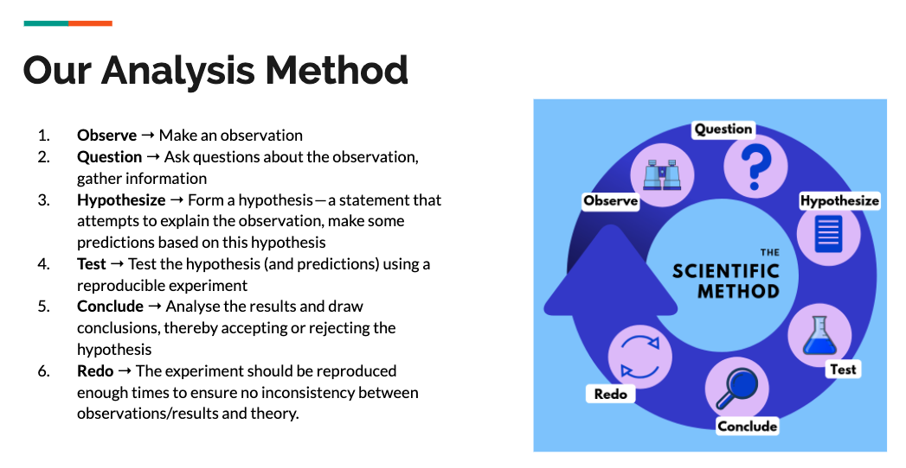

# Northwind Sample Database in SQLite

## Conducting hypothesis testing and statistical analysis on data extracted from the Northwind database
The Northwind database is a sample database for a fictional company provided by Microsoft. It is a representation of a small trading company with relational tables for customers, orders, inventory, purchasing, suppliers, shipping, and employees.

The schema for the database is as follows:

## Through hypothesis testing and statistical analysis, we will try to draw conclusions from the data.

## We will look at the following questions:
### Do discounts have a statistically significant effect on the number of products customers order? If so, at what level(s) of discount?
### Is there statistical significance in the sales revenue generated by each employee?
### Do imported goods affect sales price?
### Do the number of items in stock for each product affect sales price?
